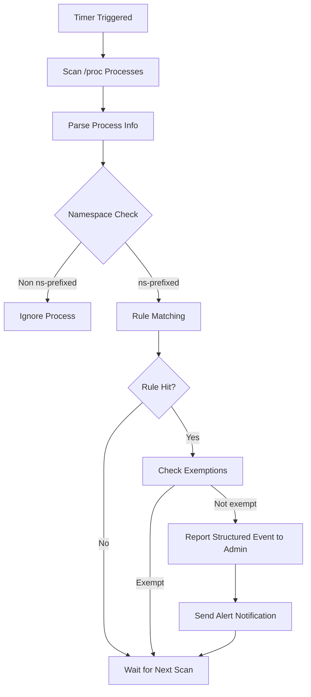

# 🛡️ ProcScan - Kubernetes Security Scanner

[](https://golang.org/)
[](LICENSE)
[]()

> A lightweight security scanning tool designed specifically for Kubernetes, focused on process monitoring and threat detection.

---

## 🎯 Overview

ProcScan is a streamlined node security tool that runs as a `DaemonSet` on every node in a Kubernetes cluster, continuously scanning for suspicious processes and executing automated responses based on a flexible rule engine.

### ✨ Key Features

- 🔍 **Process Scanning**: Real-time process monitoring based on `/proc` filesystem
- 🎯 **Intelligent Detection**: Admin-managed structured rule matching
- 📢 **Alert Notifications**: Lark (Feishu) Webhook notification integration
- 🛡️ **Automated Response**: Submit validated high-risk events to Admin's ban workflow
- ☸️ **Native Integration**: Fully compatible with Kubernetes ecosystem
- 📝 **Lightweight Configuration**: Simplified configuration file, easy to deploy and maintain

---

## 🚀 Quick Start

### Prerequisites

- Kubernetes 1.19+
- Go 1.24+ (development environment only)

### 1. Deploy to Kubernetes

```bash
# Clone repository
git clone https://github.com/bearslyricattack/procscan.git
cd procscan

# Create namespace
kubectl create namespace procscan

# Deploy configuration
kubectl create configmap procscan-config --from-file=config.simple.yaml -n procscan

# Deploy application
kubectl apply -f deploy/ -n procscan

# Check running status
kubectl get pods -n procscan -o wide
```

### 2. Run Locally

```bash
# Clone repository
git clone https://github.com/bearslyricattack/procscan.git
cd procscan

# Install dependencies
go mod download

# Run application
go run cmd/procscan/main.go -config config.simple.yaml
```

---

## ⚙️ Configuration

### Core Configuration File

Configure using `config.simple.yaml`:

```yaml
# Scanner configuration
scanner:
  proc_path: "/host/proc"      # Process filesystem path
  scan_interval: "30s"         # Scan interval
  log_level: "info"            # Log level
  max_workers: 2               # Concurrent scan count

  rules_refresh_interval: "30s" # Refresh Admin-managed rules
  health_port: 8081             # /healthz and /readyz

notifications:
  admin:
    base_url: "http://sealos-complik-admin:8080"
    timeout: "10s"
    basic_auth:
      username: "${PROCSCAN_BASIC_AUTH_USERNAME}"
      password: "${PROCSCAN_BASIC_AUTH_PASSWORD}"
```

Notification targets and detection rules are loaded from Admin. See
[`PROCSCAN_RULES_API.md`](../sealos-complik-admin/docs/PROCSCAN_RULES_API.md)
for the backend contract exposed to Procscan and the management frontend.

### Detection Rules

- **Process Name Matching**: Use regular expressions to match process names.
- **Command Keyword Matching**: Match suspicious command-line content.
- **Actions**: Rules may alert; only high/critical process-name rules may request a ban.
- **Exemptions**: Processes, commands, namespaces, and Pod names can be exempted.
- **Safe Refresh**: Procscan keeps its last valid compiled ruleset if a refresh fails.

---

## 📊 How It Works

### Scanning Workflow



### Response Mechanism

1. **Admin Report**: Report the rule revision, matched rule IDs, and workload attribution.
2. **Admin Validation**: Admin revalidates the event against the current rules before invoking the ban workflow.
3. **Alert and Logging**: Send Lark notifications and retain detailed detection logs.

---

## 🔧 Deployment Configuration

### DaemonSet Configuration

```yaml
apiVersion: apps/v1
kind: DaemonSet
metadata:
  name: procscan
  namespace: procscan
spec:
  template:
    spec:
      securityContext:
        seccompProfile:
          type: RuntimeDefault
        supplementalGroups:
          - 0
      containers:
      - name: procscan
        image: procscan:latest
        securityContext:
          privileged: false
          allowPrivilegeEscalation: false
          readOnlyRootFilesystem: true
          runAsNonRoot: true
          runAsUser: 65532
          runAsGroup: 65532
          capabilities:
            drop:
              - ALL
            add:
              - SYS_PTRACE
              - DAC_READ_SEARCH
        volumeMounts:
        - name: proc-path
          mountPath: /host/proc
          readOnly: true
      volumes:
      - name: proc-path
        hostPath:
          path: /proc
      tolerations:
      - key: "node-role.kubernetes.io/master"
        operator: "Exists"
        effect: "NoSchedule"
```

Procscan does not modify Kubernetes resources. Automatic namespace bans are submitted to Admin, so its ServiceAccount token is not mounted and no ClusterRole is required.

---

## 📝 Usage Examples

### Basic Monitoring

```bash
# View running logs
kubectl logs -n procscan -l app=procscan -f

# Check Pod status
kubectl get pods -n procscan -o wide

# Check readiness and recent reports
kubectl logs -n procscan -l app=procscan --tail=100
```

Notification targets are managed through Admin's `procscan_notifications_runtime`
configuration and exposed to Procscan through the dedicated runtime endpoint.

---

## 🛠️ Development Guide

### Building the Project

```bash
# Local build
go build -o procscan cmd/procscan/main.go

# Cross-compilation
GOOS=linux GOARCH=amd64 go build -o procscan-linux-amd64 cmd/procscan/main.go
```

### Project Structure

```
procscan/
├── cmd/procscan/          # Application entry point
├── internal/              # Core business logic
│   ├── scanner/          # Scanning engine
│   ├── container/        # Container management
│   └── notification/     # Notification system
├── pkg/                   # Common components
│   ├── config/           # Configuration management
│   ├── k8s/              # Kubernetes client
│   ├── logger/           # Logging component
│   └── models/           # Data models
├── deploy/               # Deployment manifests
├── config.simple.yaml    # Simplified configuration file
└── README.md
```

---

## 🚨 Troubleshooting

### Common Issues

1. **Admin authentication or rule loading failed**
   ```bash
   kubectl logs -n procscan -l app=procscan | grep -E 'ruleset|unauthorized|NotReady'
   ```

2. **Configuration File Error**
   ```bash
   # Verify configuration file
   kubectl get configmap procscan-config -n procscan -o yaml
   ```

3. **Container Runtime Connection Failed**
   ```bash
   # Check /proc mount
   kubectl exec -n procscan <pod> -- ls -la /host/proc
   ```

### Log Analysis

```bash
# View detailed logs
kubectl logs -n procscan <pod> --tail=100

# Search for error messages
kubectl logs -n procscan -l app=procscan | grep -i error
```

---

## 📄 License

This project is licensed under the Apache License 2.0. See the [LICENSE](LICENSE) file for details.

---

## 🤝 Contributing

Issues and Pull Requests are welcome!

1. Fork this repository
2. Create your feature branch (`git checkout -b feature/AmazingFeature`)
3. Commit your changes (`git commit -m 'Add some AmazingFeature'`)
4. Push to the branch (`git push origin feature/AmazingFeature`)
5. Open a Pull Request

---

> **Project Maintainer**: ProcScan Team
> **Last Updated**: 2025-10-21
> **Version**: v1.0.0-alpha
